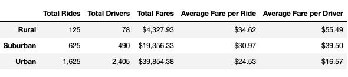
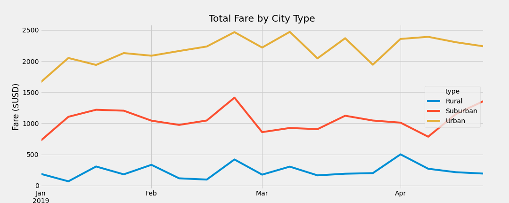

# PyBer_Analysis
# PyBer_Analysis

## Overview of the analysis: Explain the purpose of the new analysis.
For this analysis, we first need to make a summary DataFrame of the ride-sharing data by city type. After we make the summary DataFrame, we need to make a multiple-line graph in order to represent the total weekly fares for the urban, suburban, and rural types. Using this new information, we need to point out the differences and see how the company (V. Isualize and Omar) can utilize this information.

## Results: Using images from the summary DataFrame and multiple-line chart, describe the differences in ride-sharing data among the different city types.

If we first look at the table along, we can already see that urban areas have approximately 5 times the amount of drivers in suburban areas and almost 30 times the amount of drivers in rural areas. When looking at the total rides, urban areas constitute about over half of this amount; 1625 out of 2375 rides, which is approximately 68.42% of the rides. Even though urban areas consist of the majority of total fares, when we look at the average fare per ride and average fare per driver, we can see that they have a negative correlation with total rides and total drivers. The script is basically flipped for both average fare per ride and per driver; rural areas have the highest averages in these categories. Suburban areas remain middleground in this data. 

Another difference to look at is between the total rides and total drivers. Even though there are less drivers, the drivers have to drive approximately twice (125/78=1.60) as much as the other categories. Suburban drivers only have to drive once or twice (625/490=1.28) and urban drivers have to compete in order to make a fare (1625/2405=0.68); urban drivers could or could not have a fare. 

When looking at the graph, we can see in the beginning of the year, both urban and suburban areas start off strong becaore leveling off near the middle of January. This is where we see the differences between the three areas: urban areas have an increasing fare before the beginning of March and a few days after March, suburban areas hit their fare peak right near the end of March before decreasing, and rural areas have relatively level fare amounts over the next few months before hitting its peak near the beginning of April. This graph also shows how much more money urban areas make compared to the suburban and rural areas.

## Summary: Based on the results, provide three business recommendations to the CEO for addressing any disparities among the city types.
One of the questions to ask when making a recommendation is whether we want to even the playing field for the drivers; basically, do we want the average fare per driver to be more equal between the three categories, which in turn could also increase the average fare per ride? If that's the case, maybe urban areas could charge more per ride versus suburban and rural areas. That would introduce other variables such as what constitutes an area as urban, suburban, and rural. If we increase the fare, then urban areas would need to charge approximately 3x more and suburban areas would need to charge approximately 1.5x more.

Another recommendation is to address the oversaturation of urban drivers. If that is the case, one recommendation to be made is that the business can distribute more drivers to the suburban and rural areas. In order for that to be even across the board, another analysis would have to be made including other factors that may contribute to these discrepancies. One factor that could be included is the mileage drivers have to drive from one destination to another, especially if one is going from a rural area to an urban area for example. To entice drivers to drive more in rural or suburban areas, some kind of incentive could be implemented whether that be more compensation for gas mileage or more payout for the driver for those rides only.

One last recommendation that can be made is to observe the trends for each city type and look for the reasons as to why some months are better than others. How do we maximize the amount of fare that be charged in order to either stabilize profit or increase profit in the months where it seems to drag? For example, in the suburban areas, total fare drops near the beginning of March and doesn't seem to pick up until the middle of April. Maybe increasing fares during those time, until there's a limit to the amount people are willing to pay, could potentially drive profit up for that month.
